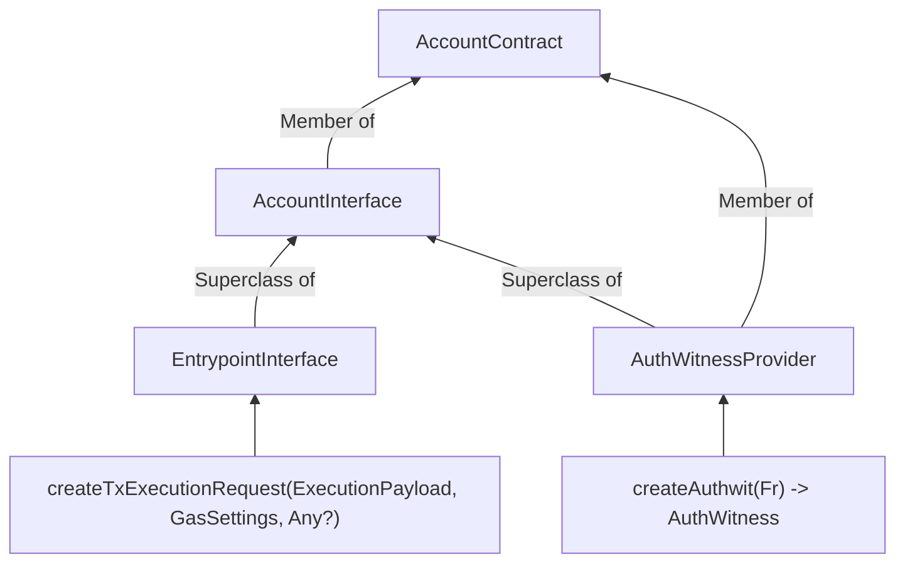

# EIP-712 Authwits Spec

**Source**: https://www.notion.so/2d59a4c092c780fd9022dda8495a6d16

## TODO

- [ ] Ask for feedback on this *format* of document
- [ ] Ensure simulations don't ask for authwits

## Objective

- Produce the code changes (either on a custom wallet or helper-wide) required to be able to
  - Ask for an EIP-712 authorization to a function call (i.e., replace `assert_current_call_valid_authwit`)
  - Ask for an EIP-712 authorization to an arbitrary Noir struct
- Benchmark that shit

## Background

Alternatively, see [EIP-712 Aztec background research](./01-background-research.md)

### EIP-712

[EIP-712](https://eips.ethereum.org/EIPS/eip-712) defines a mapping between an instance of any typed struct (and hierarchy thereof) and a payload, so that a signature over the payload is a valid signature of the struct itself. If we want a Metamask signature of an EIP-712 to be a valid authwit, we need to constrain the computation of said signature itself.

The reader is expected to understand how this payload is constructed (which can be done by reading EIP-712's specification) before proceeding with this document.

As a refresher though, the reader is reminded that this payloads looks like this:

```rust
"\0x19\0x01" || hashStruct(eip712Domain) || hashStruct(message)
```

Where `hashStruct` is a 32bytes commitment to a structs' shape and content. `message` is arbitrary and:

```rust
struct eip712Domain {
  string name, // of the dApp
  string version, // of the dApp
  uint256 chainId,
  address verifyingContract, // contract verifying the signature
  bytes32 salt,
}
```

Unneeded fields can actually be left out (preserving order).

### Aztec

**Noir**

Contracts are currently calling `assert_current_call_valid_authwit` which transports the current function call as offchain (local, private) effects, and then constructs the inner hash from the function selector, message sender, and arguments hashes. It then calls `verify_private_authwit` which computes an `outer_hash` that incorporates the Aztec chain ID as well as the Aztec rollup version, and feeds it to `is_valid_impl` that checks for an authwit for that.

On the other hand, the default `entrypoint` function executes a logic on its own, calling `is_valid_impl` itself, where the payload is a hash of the app functions to call. Since the called functions' signature is unknown at compile time, this is the most challenging modification to define.

**TS**

This is the interfaces diagram:



There's a `DefaultAccountContract` from which ECDSA wallet derives from it and just defines its own `AuthWitnessProvider`, which simply signs the `outer_hash` and delivers the `(r, s)` point that acts as signature.

The default implementation of `createTxExecutionRequest` queries the `AuthWitnessProvider` to get an authorization for the hash of the encoded calls.

## Approaches outline

We'll be replacing or modifying some or all of the functions above, so that the final result is the one desired, as described in the Objective section.

With respect to `eip712Domain`, we have a choice to make. We *cannot* use it to encode e.g. the calling contract's address, as this object is understood as EVM-specific (i.e., `verifyingContract` must be an Ethereum address). We can either:

1. Try to fit some dApp specific data into the `eip712Domain` (`name` and `version`)
2. Use it for Aztec rollup data:
   - `name = "Aztec"`
   - `version`: Aztec rollup version
   - `chainId`: ID of the Ethereum chain where the Aztec rollup we're using is running
   - `verifyingContract`: the Aztec rollup contract

   And then domain-separate for the app inside the message.

The author is fonder of the later, and will construct the proposal for such case, going forwards.

However, there are two possible approaches with different tradeoffs:

1. Make account-contract specific changes only.
2. Change the helpers that *app* developers use to request authwits.

Option 1 doesn't add any cost to users that don't use the custom Metamask account contract, at the expense of giving more freedom to frontends on what shape the message takes (and thus potential attackers). However, we'll see that option 2 actually needs to resort to something like option 1 for the `entrypoint`.

These approaches both bind the signature to the specific function calls that are gonna be authorized, by leveraging the following `PrivateContext`'s methods:

- `msg_sender`: the contract address initiating the function call
- `get_args_hash`: the hash of the arguments
- `function_selector`: the function selector of the currently executing function

Since in both approaches `entrypoint` is defined specifically on the account contract, and cannot assume anything about the callees, this modification is common to both options and will be approached first.

### Entrypoint modification

The entrypoint code must perform authorization for an unknown number of external calls to functions of unknown signature (name and arguments, including the *number* of arguments).

The entrypoint expects an [`AppPayload`](https://github.com/AztecProtocol/aztec-packages/blob/v3.0.0-nightly.20251225/noir-projects/aztec-nr/aztec/src/authwit/entrypoint/app.nr#L11-L23) object, which includes `ACCOUNT_MAX_CALLS` (currently 5) elements of type [`FunctionCall`](https://github.com/AztecProtocol/aztec-packages/blob/v3.0.0-nightly.20251225/noir-projects/aztec-nr/aztec/src/authwit/entrypoint/function_call.nr#L11-L24). These are of compile-time-known size, as they store the `args_hash: Field` variable, not the arguments themselves.

The relevant fields of `FunctionCall` are the following:

- `target_address`
- `args_hash`
- `function_selector`

These are computed as follows:

```rust
// https://github.com/AztecProtocol/aztec-packages/blob/v3.0.0-nightly.20251225/noir-projects/aztec-nr/aztec/src/hash.nr#L59-L65
// In practice, `args` is the concatenation of the serialization of the arguments
pub fn hash_args<let N: u32>(args: [Field; N]) -> Field {
    if args.len() == 0 {
        0
    } else {
        poseidon2_hash_with_separator(args, DOM_SEP__FUNCTION_ARGS)
    }
}

// https://github.com/AztecProtocol/aztec-packages/blob/v3.0.0-nightly.20251225/noir-projects/noir-protocol-circuits/crates/types/src/abis/function_selector.nr#L33-L39
pub fn from_signature<let N: u32>(signature: str<N>) -> Self {
    let bytes = signature.as_bytes();
    let hash = crate::hash::poseidon2_hash_bytes(bytes);

    // `hash` is automatically truncated to fit within 32 bits.
    FunctionSelector::from_field(hash)
}
```

This inspires the following definition for the EIP-712 payload's message for an entrypoint function:

```rust
struct EntrypointAuthorization {
  AppDomain appDomain,
  FunctionCall[MAX_ACCOUNT_CALLS] functionCall,
  uint256 txNonce,
}

struct AppDomain {
  string name, // of the dApp, in this case something like "EVM Aztec Wallet", but better plz because it's confusing
  string version,
  uint256 chainId,
  bytes32 salt,
}

struct FunctionCall {
  bytes32 contract,
  string functionSignature,
  uint256[] arguments
}
```

This scheme provides the most performant approach, while being unambiguous, at the expense of expressiveness. Alternative schemes can be defined, but all of them come at the expense of one or more of the following:

- Performance
- Security
- Generality

An exploration of some of these alternatives is performed in appendix 1.

The advantage of this method is that the struct's shape is known at compile time, and as such, their type hashes can be magic values that don't demand runtime computation.

The authorization will be the Ethereum wallet's signature of an instance of `Entrypoint`, and the struct's values will be fed via oracle *as **`Fields`***, except for `AppDomain.name` and `AppDomain.version`, which are gonna be hardcoded (because they pertain to the account contract).

The struct's fields are received as `Field` elements that are afterwards converted to arrays of `u8` (for the keccak function) with the [ABI encoding](https://docs.soliditylang.org/en/latest/abi-spec.html) of the argument (big endian). The payload is reconstructed using the `u8` version of the struct values, while the `Field` versions are used to reconstruct the `FunctionCall` objects that the contract calls. Therefore binding the signature to the function call.

**How to**:

Don't use Aztec's `AccountActions::entrypoint`. Don't modify it, but rather just write a custom entrypoint for this specific account contract, which behaves as follows.

For each function call:

1. Get the following via oracle calls for each function call (with which to reconstruct [`FunctionCall`](https://github.com/AztecProtocol/aztec-packages/blob/v3.0.0-nightly.20251225/noir-projects/aztec-nr/aztec/src/authwit/entrypoint/function_call.nr#L11-L24)):
   - `serialized_args: [Field; MAX_SERIALIZED_ARGS_FIELDS]`
   - `len_serialized_args: u8`
   - `function_signature: str<MAX_SIGNATURE_SIZE>`
   - `len_function_signature: u8`
2. Reconstruct the args hashes with a modified version of `hash_args` that takes in `len_serialized_args` as well, which indicates the length of the data to hash.
3. Reconstruct function signature with a similarly modified version of `from_signature`.
4. Construct the associated `FunctionCall` object and verify that it matches.
5. Compute `hashStruct` of the function call as `keccak256(typeHash || encodeData(s))` where:
   - `typeHash` is the following pre-computed value:
     `keccak256("FunctionCall(bytes32 contract,string functionSignature,uint256[] arguments)")`
   - `encodeData(s)` is the concatenation of:
     - `target_address` as `[u8; 32]`
     - `keccak256(function_signature as [u8; MAX_SIGNATURE_SIZE], len_function_signature)`
     - `keccak256(arguments as [u8; 32 * MAX_SERIALIZED_ARGS_FIELDS], 32 * len_serialized_args)`, where the conversion must be done argument-per-argument

Afterwards, compute the EIP-712 payload as `keccak256(typeHash || encodeData(s))` where:

- `typeHash` is the following pre-computed value:
  `keccak256("EntrypointAuthorization(AppDomain appDomain, …)AppDomain(…)FunctionCall(…)`
- `encodeData(s)` is the concatenation of:
  - The `hashStruct` of `appDomain`, which is constant per-contract per-deploy, and computed similarly as everything before.
  - `keccak256(hashStruct(functionCall[0]) || ... || hashStruct(functionCall[ACCOUNT_MAX_CALLS-1]))`

Then, fetch the whole EIP-712 payload's signature:

- `ecdsa_signature: [u8; 64]`

And check that it's signed by the public key (obtained as the signature of some pre-defined EIP-712 message).

**TODO**:

- [ ] For the entrypoint, the inner hash is meaningless, no? we're doing our own variant of `is_valid_impl` precisely for the `entrypoint`.
- [ ] Cry in a corner, then work out how t.f. the modifications to the TS side are gonna work
- [ ] Explain the alternative of unconstrained type for `arguments` in Appendix 1, including the increase in costs plus the decrease in security

### Option 1 - Changes only to the account contract

The very same method can be used in order to authenticate individual function calls (whenever a contract calls `assert_current_call_valid_authwit`). The entrypoint authorization itself can be thought of as an authorization for a contract call by the account contract (hence why the `AppDomain` contains information about the account contract itself).

However, in order to allow for inner inspection of the function calls' arguments (instead of their arguments, which are just opaque hashes of the called function's arguments), it needed special treatment. The proposed structure for arbitrary function calls is slightly different thus:

```rust
struct FunctionCallAuthorization {
  AppDomain appDomain,
  FunctionCall functionCall
}

struct AppDomain {
  // contract name is not available to check against
  // contract version is not available to check against
  uint256 chainId,
  bytes32 verifyingContract // available
}

struct FunctionCall {
  // ...
}
```

A similar approach as that for `entrypoint` is taken, but this time we've received an `outer_hash` from the app against which to compare. So we:

- Reconstruct the `outer_hash` from the authwit's stuff and ensure it matches the one with which `verify_private_authwit` is called
- Reconstruct the EIP-712 payload, and ensure we've also received its signature from the oracle

---

## Appendix 1: Alternative schemes for call structures

### `bytes32`, `int256`, and `uint256` for arguments

A slight improvement in expressiveness with respect to the baseline proposal is to allow each argument to be either `bytes32`, `int256`, or `uint256`.

The rationale for this decision is that:

- It would allow everything to be shown in the proper format by the Ethereum wallet (`uint256` for any positive number, `int256` for negative numbers as well, and `bytes32` for addresses).
- The encoding from `Field` to these is straightforward, since they have the same size.

To do so, the scheme should be the following:

```rust
struct EntrypointAuthorization {
  AppDomain appDomain,
  FunctionCall1 functionCall1,
  ...,
  FunctionCall5 functionCall5, // each one must be different now
  uint256 txNonce,
}

struct FunctionCall1 {
  bytes32 contract,
  string functionSignature,
  Arguments1 arguments
}

// ...
```

Where `Arguments1` is a struct with up to `N` arguments, all named sequentially as `arg1`, `arg2`, etc, and every one of them is either `bytes32`, `int256`, or `uint256`. E.g.,

```rust
struct Arguments1 {
  bytes32 arg1,
  bytes32 arg2,
  uint256 arg3,
  uint256 arg4
}
```

for `transfer_private_to_private`.

In order to achieve this, a merkle root for struct hashes should be constructed. The number of possible such structures is `3^(N+1)-1`, so that a merkle tree with `ceil((N+1) log(3)/log(2))` levels suffices to store the whitelist. Alternatively, since it's expected that most functions needn't signed integers, we could have a separate tree for structs that don't use `int256` with exactly `N+1` levels.

In this alternative, the type hashes for the `Arguments` structs are comptime numbers (that are stored in a merkle tree) but the final `FunctionCall` struct has a different type hash depending on the choices for each of these.

**Unchecked assumption**: The encoding of `uint256` and `bytes32` is the same.

### Unconstrained `Arguments` structs

Alternatively, the `Argument` structs may go unchecked. The frontend chooses this shape. This would allow a well behaved frontend to construct e.g.:

```rust
FunctionCall1 {
  contract: 0x123, // E.g. a stablecoin's address
  signature: "transfer_private_to_private(AztecAddress,AztecAddress,u128,Field)",
  Arguments1: {
    from: 0x456,
    to: 0x321,
    value: 100,
    _nonce: 4
  }
}
```

which looks way clearer.

It would also allow a phishing frontend to construct the following deceitful message:

```rust
FunctionCall1 {
  contract: 0x123, // E.g. a stablecoin's address
  signature: "transfer_private_to_private(AztecAddress,AztecAddress,u128,Field)",
  Arguments1: {
    to: 0x321, // victim's address
    from: 0x456, // attacker's address,
    value: 100,
    _nonce: 4
  }
}
```

Where the order of `to` and `from` are swapped from what the function expects.
